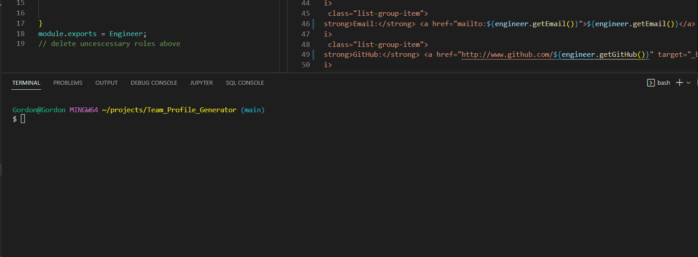

# Team_Profile_Generator

# Description
An application that will construct employee profile cards using the command line to fill the information out. The answers that are stored will then be rendered into the dist HTML file and disaplyed and wrapped in a bootstrap format. 
# Instilation
```
for this application to run you will use **node server.js** 
```

# Live Demo


# Screenshot


# Usage
This appication will be used for an individual in the admin position of a company. The individual with this application will be able to organize their workforce with this simple app. With the features such as showing which school office number and github account this application strives to be the best. 

# Liscence
[](https://opensource.org/licenses/MIT)
# Acceptance criteria
``
GIVEN a command-line application that accepts user input
WHEN I am prompted for my team members and their information
THEN an HTML file is generated that displays a nicely formatted team roster based on user input
WHEN I click on an email address in the HTML
THEN my default email program opens and populates the TO field of the email with the address
WHEN I click on the GitHub username
THEN that GitHub profile opens in a new tab
WHEN I start the application
THEN I am prompted to enter the team manager’s name, employee ID, email address, and office number
WHEN I enter the team manager’s name, employee ID, email address, and office number
THEN I am presented with a menu with the option to add an engineer or an intern or to finish building my team
WHEN I select the engineer option
THEN I am prompted to enter the engineer’s name, ID, email, and GitHub username, and I am taken back to the menu
WHEN I select the intern option
THEN I am prompted to enter the intern’s name, ID, email, and school, and I am taken back to the menu
WHEN I decide to finish building my team
THEN I exit the application, and the HTML is generated
``